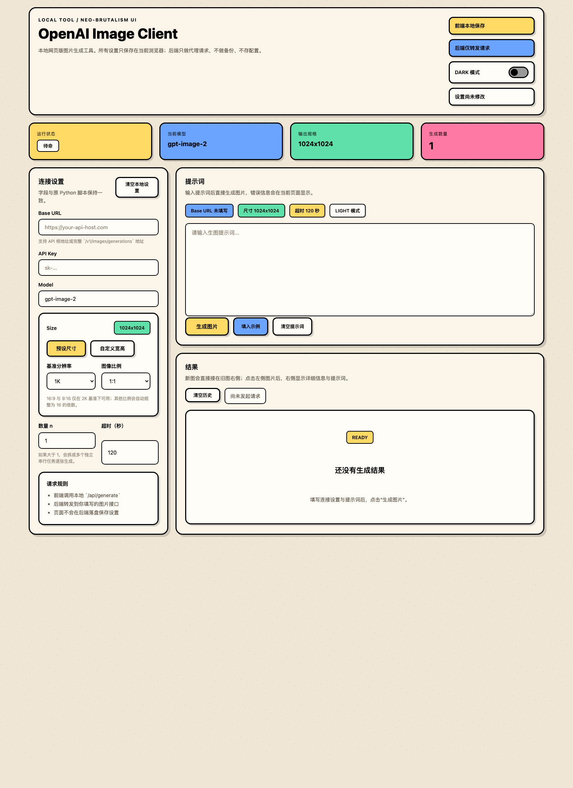

# OpenAI Compatible Image Client

[English README](README_EN.md)

一个简洁的 OpenAI 风格生图客户端，包含两种使用方式：

1. Python CLI 脚本
2. 本地 Web UI

适合接兼容 OpenAI Images API 的中转服务、自建代理或网关。

## Web UI 截图



---

## 特性

- 兼容 `POST /v1/images/generations`
- 支持填 API 根地址或完整图片接口地址
- 同时提供 CLI 和 Web UI
- Web 设置只保存在浏览器本地 `localStorage`
- 后端不保存前端设置、不做备份
- 支持上游返回 `b64_json` 或 `url`

---

## 目录说明

```text
.
├── generate_image.py      # CLI 生图脚本
├── web_app.py             # 本地 Web 服务
├── web/                   # 前端页面
├── config.json.example    # 示例配置
└── requirements.txt
```

---

## 1. CLI 脚本

### 安装依赖

```bash
python3 -m venv .venv
source .venv/bin/activate
pip install -r requirements.txt
```

### 配置

建议复制示例配置到本地私有文件：

```bash
cp config.json.example config.local.json
```

然后编辑 `config.local.json`，填写：

- `base_url`
- `api_key`
- `prompt`

脚本会优先读取：

1. `config.local.json`
2. `config.json`

### 运行

```bash
python generate_image.py
```

也可以完全通过命令行参数传入：

```bash
python generate_image.py \
  --base-url "https://your-api-host.com" \
  --api-key "your_api_key" \
  --prompt "A cute orange cat astronaut"
```

---

## 2. 本地 Web UI

### 特点

- Neo-Brutalism 风格页面
- 图片历史保留在同一个结果区
- 点击图片后右侧显示详细信息与提示词
- 支持图片放大预览
- 多图请求会拆成串行单任务执行
- 所有前端设置自动保存在当前浏览器本地

### 启动

```bash
python3 -m venv .venv
source .venv/bin/activate
pip install -r requirements.txt
python web_app.py
```

默认访问地址：

```text
http://127.0.0.1:8000
```

### 说明

- `Base URL` 可填 API 根地址，例如 `https://your-api-host.com`
- 也可直接填完整接口地址，例如 `https://your-api-host.com/v1/images/generations`
- 如果上游返回 `b64_json`，页面会直接显示
- 如果上游返回 `url`，后端会先下载图片，再返回给前端显示
- 后端不会替你保存前端输入的配置
